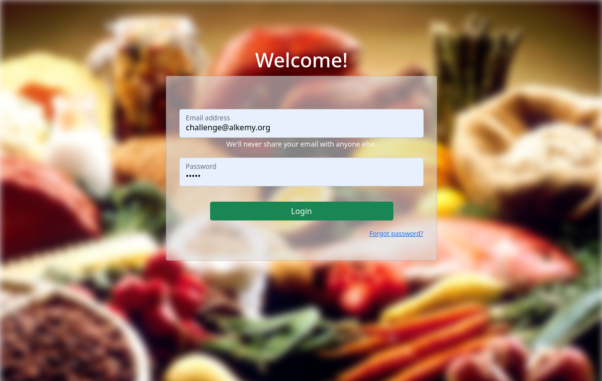
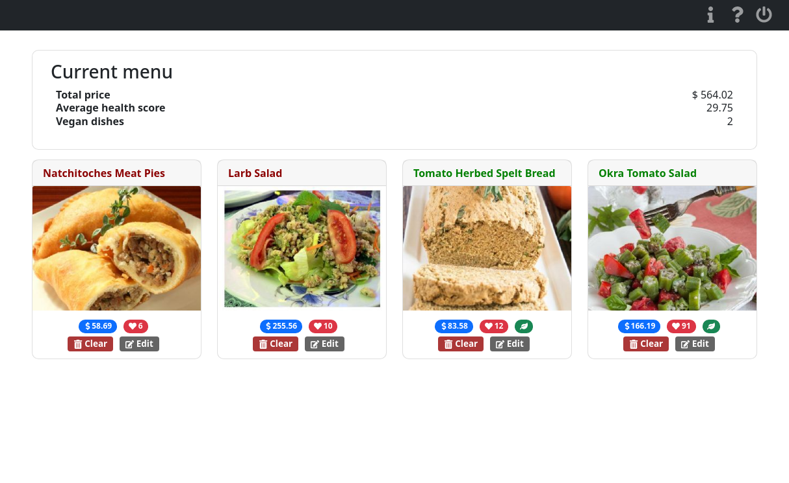
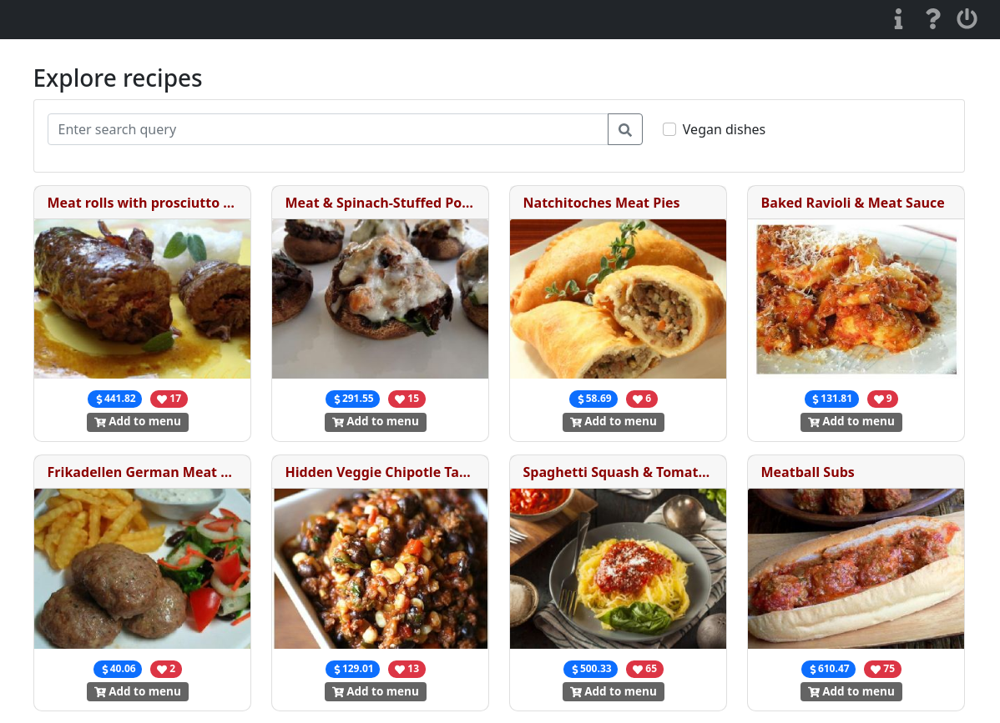

# Challenge front-end Alkemy: React

<p align="">
    
    
</p>

### App available online on [this link](http://alkemy-spoonacular-app.herokuapp.com/)!

<b>User:</b> challenge@alkemy.org  
<b>Password:</b> react  


## Installation

To run this app locally, clone this repo and install dependencies, configure environment variables (you will need a Spoonacular api-key) and compile the production version. 

1. Clone this repo  
    ```bash
    git clone https://github.com/matiasmicheletto/alkemy-spoonacular-app.git
    ```

2. Go to front-ent folder  
    ```bash
    cd alkemy-spoonacular-app/client
    ```

3. Add environment variables (replace ???? with your api-key)  
    ```bash
    cat > .env << EOF
    REACT_APP_API_KEY=?????
    REACT_APP_API_URL=https://api.spoonacular.com/recipes/complexSearch
    REACT_APP_LOGIN_URL=http://challenge-react.alkemy.org/
    EOF
    ```

4. Install front-end dependencies
    ```bash
    npm install
    ```

5. Compile production optimized version
    ```bash
    npm run build
    ```

6. Go back to root folder and install backend dependencies
    ```bash
    cd .. && npm install
    ```

7. Start the local web server (localhost:3000)
    ```bash
    npm start 
    ```

## Screenshots






## Documentation

The goal is to develop a web application for choosing the dishes options of a menu for a hotel and showing different attributes of each dish along with the complete menu. An external API will be used to consume data and search the dishes.

Functional and non functional requirements are detailed in this [document](doc/specifications.pdf).

### Project structure
```
root
|  .env  
|  .gitignore  
|  index.js         <-- Entry point  
|  package.json
|  package-lock.json
|
└── models          <-- Back-end
|   |  server.js
|
└── client          <-- Front-end
    |  .env
    |  .gitignore
    │  package.json
    │  package-lock.json
    │
    └── public
    |      ...   
    └── src
       | App.js
       | index.js
       | setupTests.js
       | utils.js
       └── views
       └── modals
       └── components
       └── img
       └── context
       └── middleware

```


